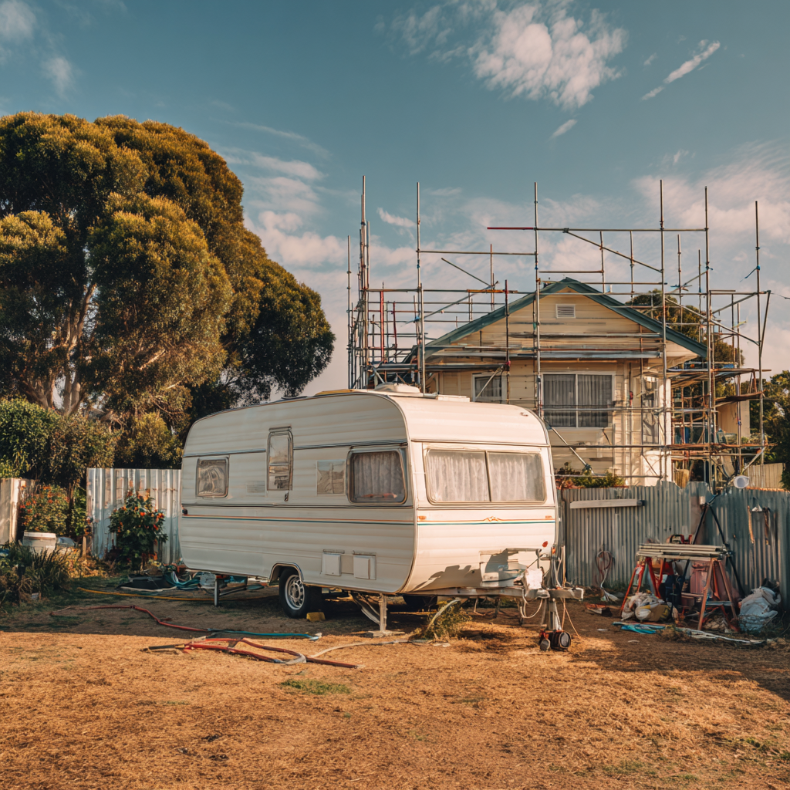
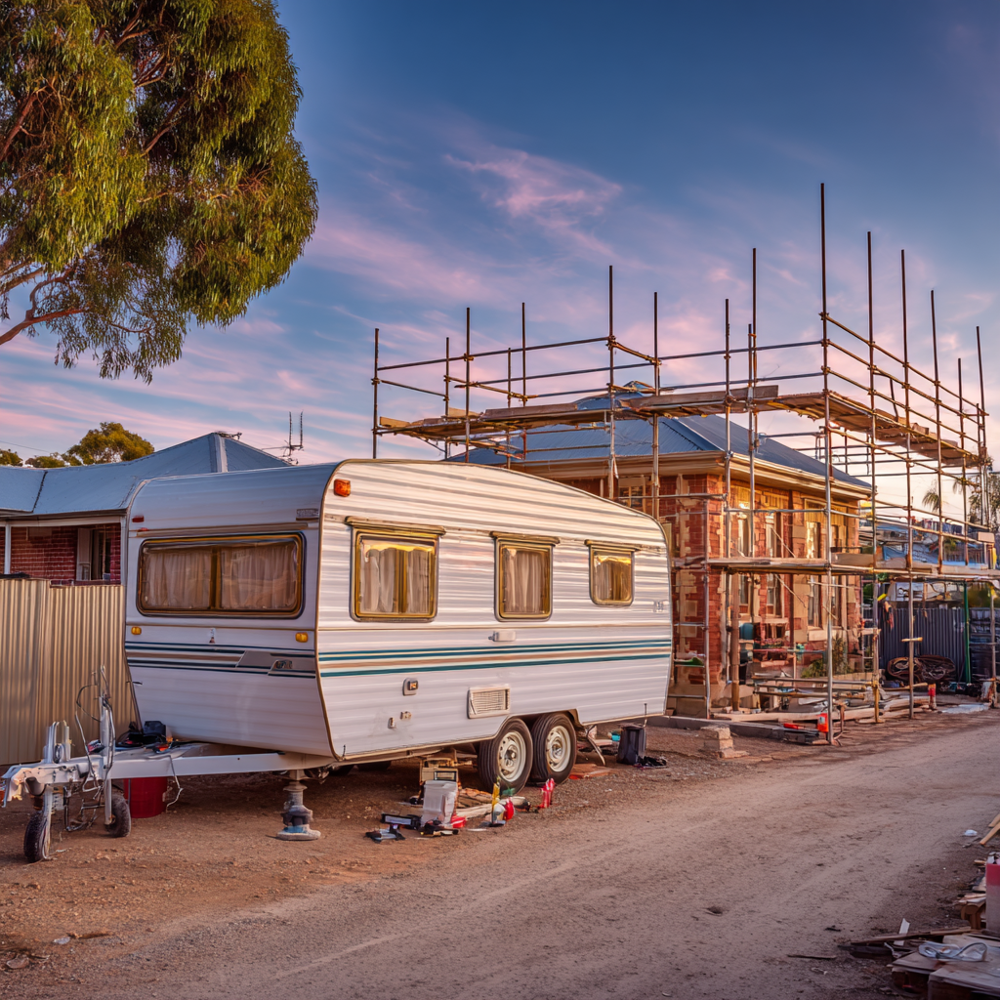

# Temporary Housing with Residential Caravans in South Australia

Finding flexible temporary housing can be challenging, especially during home renovations, relocation, or property transitions. In South Australia, traditional rental housing often requires long-term leases, deposits, and moving to another neighbourhood. These arrangements are usually designed for long-term living, which makes them less practical when accommodation is only needed for several months.

Because of this, many homeowners and remote workers are starting to explore alternative housing solutions that provide flexibility without requiring long-term commitments. One option that is becoming more common is residential caravan accommodation.

A residential caravan can function as a compact living space that is installed on private land while renovation or construction work continues in the main house. Instead of relocating to another apartment or staying in a hotel, homeowners can remain close to their property while maintaining a comfortable temporary living environment.

## Why Caravan Living Can Work as Temporary Housing

Residential caravans are often associated with travel or holidays, but modern caravans can also serve as practical temporary homes. When placed on private property and connected to electricity and water, they provide a functional space where people can sleep, prepare simple meals, and continue their daily routines.

This type of housing works particularly well during transitional periods when people need accommodation for a limited time.

Common situations where caravan accommodation may be useful include:

- living on-site during major home renovation projects  
- temporary relocation for construction or contract work  
- housing between selling one property and purchasing another  
- accommodation for remote workers or project-based employment  
- temporary housing while waiting for property settlement  

In these situations the goal is not permanent housing, but rather a flexible place to stay while larger life transitions are taking place.

## Comparing Temporary Housing Options

When evaluating temporary housing options, homeowners often compare several different solutions depending on cost, flexibility, and convenience.

| Housing option | Advantages | Limitations |
|---|---|---|
| Rental apartment | Full living space and stability | Requires long-term lease and deposit |
| Hotels | Easy to arrange quickly | Very expensive for extended stays |
| Short-term apartments | Furnished and flexible | Limited availability in some locations |
| Residential caravans | Flexible, affordable, located on private land | Smaller living space |

While caravans provide less space than a traditional house or apartment, they can offer flexibility that other housing options cannot provide during short-term situations.

## Benefits of Staying Close to the Renovation Project

Another advantage of caravan accommodation is the ability to remain close to the renovation site. When temporary housing is placed directly on the property, homeowners can monitor construction progress more easily and communicate with builders if questions or unexpected issues arise.

Instead of travelling across the city to check the progress of a renovation, homeowners can simply step outside and speak directly with contractors. This can make renovation management more efficient and reduce the stress that often comes with large construction projects.

Being close to the project also allows homeowners to stay involved in important decisions that may occur during renovation work.

## Additional Resources

For readers interested in learning more about flexible housing ideas and caravan living during renovation projects, some additional articles can be found on the Caravan Hire SA blog:

https://caravanhiresa.au/blog/

These resources explore how residential caravans can be used as practical temporary housing during renovations, relocation periods, or other transitional situations.

## Conclusion

Temporary housing needs can arise unexpectedly during renovations, relocation, or property transitions. Traditional rental housing is often designed for long-term living and may not provide the flexibility required in these situations.

Residential caravan accommodation offers an alternative solution that allows homeowners to remain close to their property while maintaining a functional living space. Although the living area is smaller than a traditional home, the flexibility and convenience can make caravan living a practical option during temporary housing situations.
