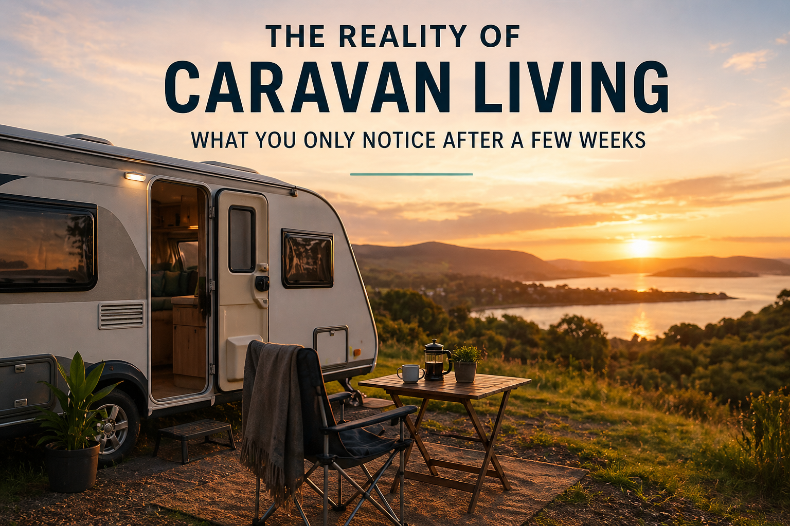

# The Reality of Caravan Living: What You Only Notice After a Few Weeks

At first, living in a caravan feels like a temporary adjustment. You expect the biggest challenge to be the size of the space, the limited storage, or the lack of привычного комфорту. But after a few weeks, it becomes clear that the real difference is not physical — it’s behavioral.

Caravan living changes how you interact with your environment on a daily basis.

The most noticeable shift is how aware you become of your routines. In a regular home, space allows you to ignore inefficiencies. You can leave things for later, move between rooms without thinking, and accumulate items without immediate consequences. In a caravan, none of that works the same way.

Every action has a visible impact.

---

## How daily habits begin to change

The first few days are all about adaptation. You start figuring out where things go, how to organize your space, and how to make simple routines work within new limits.

But after that, something interesting happens.

- you stop overcomplicating basic tasks  
- you develop consistent routines faster  
- you become more intentional with your time  
- you rely less on unnecessary distractions  

Simple activities like cooking or cleaning no longer feel like chores. They become short, structured tasks that are completed quickly and efficiently.

This creates a different rhythm of life — one that feels more controlled and less chaotic.

---

## The role of environment in focus and productivity

One of the unexpected effects of caravan living is how it impacts concentration.

Without multiple rooms, large пространства, or constant background noise, your environment becomes much more direct. There are fewer visual distractions and fewer reasons to switch tasks.

This forces a different kind of focus.

You don’t rely on external structure — you create your own.

For remote work or independent tasks, this can actually be an advantage. A small, well-organized space reduces decision fatigue and allows you to concentrate on what matters.

---

## What feels different compared to traditional housing

Over time, the differences between caravan living and traditional renting become more obvious.

| Aspect              | Traditional Housing | Caravan Living |
|--------------------|--------------------|----------------|
| Space usage        | Often inefficient  | Highly optimized |
| Daily routines     | Flexible but chaotic | Structured and consistent |
| Maintenance        | Time-consuming     | Minimal        |
| Cost structure     | Variable           | More predictable |

The key difference is not comfort, but clarity.

In a caravan, everything has a defined role. There is less ambiguity in how space is used, and that reduces friction in everyday life.

---

## The psychological effect of living with less

Another important aspect is the mental shift that happens over time.

At first, limited space feels like a constraint. But as you adapt, it starts to feel like a filter — something that removes unnecessary elements from your life.

- fewer decisions about what to keep or use  
- less visual clutter  
- reduced need for constant organization  
- more awareness of priorities  

Instead of feeling restricted, many people start to feel more in control.

This is one of the reasons why caravan living is often connected to the idea of simple living, even if it wasn’t the original goal.

---

## When this type of living makes sense

Caravan living is not designed for every situation, but it works well in specific contexts:

- temporary housing during transitions  
- periods of relocation or uncertainty  
- cost reduction without sacrificing functionality  
- situations where flexibility is more important than permanence  

In these scenarios, the goal is not to maximize space, but to optimize it.

---

## A practical perspective

One of the reasons people start exploring caravan living is the search for alternatives to traditional rental systems. In situations where long-term leases and high costs don’t make sense, more flexible solutions become relevant.

A practical example of how this works in real conditions can be seen here:
https://caravanhiresa.au/

This type of setup shows that caravan living is not just about travel. It can function as a structured and realistic housing option.

---

## Final thought

Caravan living doesn’t just change where you live — it changes how you live.

It highlights how much of everyday life depends on space, structure, and привычки. By reducing the size of the environment, it makes those patterns visible.

And once you see them clearly, it becomes much easier to decide what actually matters.
